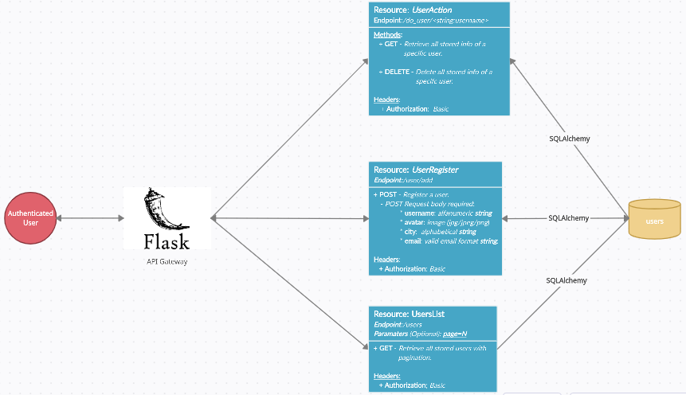
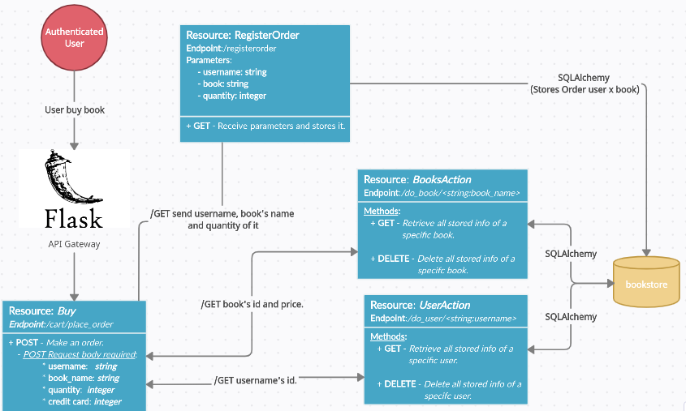
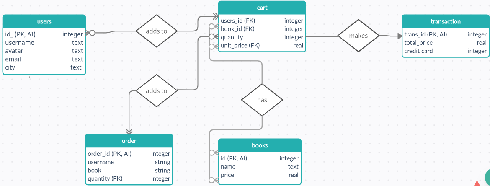

## Test 1: Sistema de gestão de usuários

1. **pip install -r requirements.txt** 
2. **sudo apt-get install postgresql postgresql-contrib**
3. **sudo -u postgres -i**
4. **psql**
5. **\password** ; Dê `enter`, em seguida ponha a senha: `123456`   
6. **python empiricus_tests/app/run.py** ; Usuário: `empiricus` , Senha: `admin` para utilizar a API (*Authorization Basic*)

| |
| :-: |
| Arquitetura |

**DB Schema**: [.scheme](docs/imgs/schema_test1.png) →→
**Resources**: [UserAction](docs/imgs/useraction.png) | [UserRegister](docs/imgs/useregister.png) | [UsersList](docs/imgs/userslist.png) →→
**Tutorial**: [Coleção de Postman's Requests](docs/tutorial)
---

## Test 2

| |
| :-: |
| Arquitetura |

| |
| :-: |
| Database: Modelo Entidade Relacionamento |

